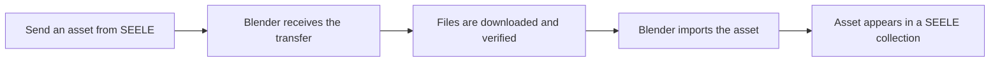

# SEELE Transfer for Blender

Import assets from SEELE directly into Blender with a secure, one-click transfer workflow.


SEELE Transfer connects the SEELE website to Blender. It receives an asset, verifies the download, imports it with Blender's native tools, and places the result in a dedicated collection—without asking users to configure URLs, ports, download hosts, or cache paths.

## Features

- Send a Workspace FBX asset from SEELE to Blender in one action.
- Download, verify, and import transferred files automatically.
- Keep each imported asset organized in its own `SEELE_<name>` collection.
- Track transfer and import progress from the SEELE sidebar in Blender.
- Cancel an in-progress transfer and clean up incomplete imports safely.
- Frame the imported model from the sidebar when you are ready to inspect it.
- Clear downloaded transfer files without locating the cache manually.

## Requirements

- Blender 4.0 or newer.
- Access to the SEELE website at [seeles.ai](https://www.seeles.ai).
- An internet connection for downloading transferred assets.
- Localhost access to `127.0.0.1:9878` for communication between SEELE and Blender.

This package is a Blender add-on and does not become part of exported assets or runtime builds.

## Installation

Download the official package from [GitHub Releases](https://github.com/SeeleAI/SEELE-Blender-Add-on/releases):

```text
seele-blender-0.2.3-public.zip
```

1. In Blender, open **Edit > Preferences > Add-ons**.
2. Select **Install from Disk**.
3. Choose the downloaded ZIP file.
4. Enable **SEELE Transfer**.

To upgrade, disable and remove the previous version, exit Blender completely, and install the new package. If you no longer need downloaded files, select **Clear Cache** before removing the add-on.

## Quick Start

1. Start Blender and open the **SEELE** tab in the 3D View sidebar (`N`).
2. Confirm that the receiver status is ready.
3. Open SEELE, choose an asset, and select **Send to Blender**.
4. Wait for the transfer to complete, then find the imported asset in its `SEELE_<name>` collection.

## How It Works



The add-on runs download work in the background and performs Blender operations on Blender's main thread. Technical privacy, networking, and validation details are documented separately in [Privacy and Network Behavior](docs/PRIVACY_AND_NETWORK.md).

## Compatibility

| Item | Support |
|---|---|
| Blender | 4.0 or newer with the classic add-on ZIP |
| Validated workflow | SEELE Workspace FBX to Blender |
| Additional importers | GLB, glTF, and STL when available in Blender; Web E2E validation is pending |
| Installation type | Blender Editor add-on |
| Blender Extensions packaging | Blender 4.2 or newer |

Only Workspace FBX is currently validated across the complete SEELE-to-Blender workflow. The add-on can detect other native Blender importers, but their availability does not imply completed end-to-end product validation.

## Troubleshooting

### The receiver is not ready

Make sure SEELE Transfer is enabled and keep Blender open. In the 3D View, press `N`, open the **SEELE** tab, and check the displayed receiver status. Restart Blender after upgrading the add-on.

### Send to Blender does nothing

Confirm that the sidebar reports the receiver as ready. Check whether a firewall or security tool is blocking localhost port `9878`, then retry from [seeles.ai](https://www.seeles.ai).

### The file format is unavailable

Workspace FBX is the currently validated workflow. Importer availability for GLB, glTF, and STL depends on the installed Blender version and does not yet indicate full SEELE Web support.

### The import completes with warnings

The imported result may still be usable. Review the transfer message in the SEELE sidebar and inspect materials, textures, scale, and object hierarchy before continuing your work.

For additional help, see the [Troubleshooting Guide](docs/TROUBLESHOOTING.md).

## Documentation

- [Privacy and Network Behavior](docs/PRIVACY_AND_NETWORK.md)
- [Troubleshooting Guide](docs/TROUBLESHOOTING.md)
- [Changelog](CHANGELOG.md)

## Development

Build the production installation package:

```powershell
python tools/build_packages.py
```

Run the unit tests:

```powershell
python -m unittest discover -s tests/unit -v
```

The repository contains the Blender receiver only. SEELE web services and other DCC integrations are maintained separately.

## License

Copyright (c) 2026 SEELE. All rights reserved. This project and its binary packages are proprietary unless SEELE provides a separate written license agreement. See [LICENSE](LICENSE) for details.
