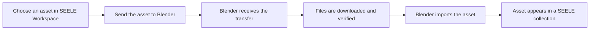

# SEELE Transfer for Blender

SEELE Transfer is a Blender AI add-on companion that imports 3D assets from SEELE Workspace into Blender through a secure, one-click transfer workflow. It is a transfer and import bridge—not an AI model generator running inside Blender.


The add-on connects the SEELE website to Blender. It receives an asset transfer, downloads and verifies the files, imports them with Blender's native tools, and places the result in a dedicated collection—without asking users to configure URLs, ports, download hosts, or cache paths.

For browser-based AI 3D model generation without installing the Blender add-on, start with [AI 3D Model Generator: Start Creating 3D Assets | SEELE AI](https://www.seeles.ai/features/tools/ai-3d-model-generator-entry). Once an asset is available in SEELE Workspace, this add-on provides the validated path for sending a Workspace FBX asset into Blender.

## What the Add-on Does

- Receives **Send to Blender** transfers from the production SEELE website.
- Downloads transferred files in the background and verifies supplied file sizes and SHA-256 checksums.
- Imports assets with Blender's available native FBX, GLB/glTF, or STL importer.
- Keeps each imported asset organized in its own `SEELE_<name>` collection.
- Tracks transfer, verification, and import progress in the SEELE sidebar.
- Cancels an in-progress transfer and rolls back incomplete imports.
- Frames a completed import for inspection and clears downloaded transfer files on request.

The complete product-validated workflow is currently **SEELE Workspace FBX to Blender**. GLB, glTF, and STL importer support is capability-based and depends on the running Blender installation; those formats do not yet have complete SEELE Web end-to-end validation.

## Who It Is For

SEELE Transfer supports a 3D asset workflow in which artists, designers, and developers:

1. Create or choose a 3D asset on SEELE.
2. Send the asset from SEELE Workspace to an open Blender session.
3. Inspect the imported collection, materials, textures, scale, and hierarchy.
4. Continue editing, scene assembly, rendering, or other Blender work with Blender's own tools.

The repository contains the Blender receiver only. SEELE web services, AI 3D model generation, and other DCC integrations are maintained separately.

## Requirements

- Blender 4.0 or newer for the classic add-on ZIP.
- Access to the SEELE website at [seeles.ai](https://www.seeles.ai).
- An internet connection for downloading transferred assets.
- Localhost access to `127.0.0.1:9878` for communication between SEELE and Blender.

This package is a Blender add-on and does not become part of exported assets or runtime builds.

## Installation

Download the official package from [GitHub Releases](https://github.com/SeeleAI/SEELE-Blender-Add-on/releases):

```text
seele-blender-0.2.3-public.zip
```

1. In Blender, open **Edit > Preferences > Add-ons**.
2. Select **Install from Disk**.
3. Choose the downloaded ZIP file.
4. Enable **SEELE Transfer**.

To upgrade, disable and remove the previous version, exit Blender completely, and install the new package. If you no longer need downloaded files, select **Clear Cache** before removing the add-on.

## Quick Start

1. Start Blender and open the **SEELE** tab in the 3D View sidebar (`N`).
2. Confirm that the receiver status is ready.
3. Open SEELE, choose an asset, and select **Send to Blender**.
4. Wait for the transfer to complete, then find the imported asset in its `SEELE_<name>` collection.

## How the SEELE-to-Blender Workflow Works



The add-on exposes a receiver on the fixed loopback address `127.0.0.1:9878`. SEELE sends a short-lived transfer manifest to that receiver; the add-on downloads the declared asset files from embedded allowed hosts, validates the manifest and available integrity metadata, and queues the import. Download work runs in the background, while Blender operations run on Blender's main thread.

Technical privacy, networking, and validation details are documented in [Privacy and Network Behavior](docs/PRIVACY_AND_NETWORK.md).

## Compatibility

| Item | Support |
|---|---|
| Blender | 4.0 or newer with the classic add-on ZIP |
| Validated workflow | SEELE Workspace FBX to Blender |
| Additional importers | GLB, glTF, and STL when available in Blender; Web E2E validation is pending |
| Installation type | Blender Editor add-on |
| Blender Extensions packaging | Blender 4.2 or newer |

Only Workspace FBX is currently validated across the complete SEELE-to-Blender workflow. The add-on can detect other native Blender importers, but their availability does not imply completed end-to-end product validation.

## FAQ

### Is SEELE Transfer an AI 3D model generator inside Blender?

No. SEELE Transfer is the Blender-side receiver and importer for assets sent from SEELE. AI 3D model generation is a separate web workflow available through the [SEELE AI 3D Model Generator](https://www.seeles.ai/features/tools/ai-3d-model-generator-entry).

### Which workflow is fully validated?

SEELE Workspace FBX to Blender is the currently validated end-to-end workflow. The add-on can advertise GLB, glTF, and STL only when their native import operators are available in the running Blender installation, but SEELE Web validation for those formats is pending.

### Does the add-on require manual server or cache configuration?

No. The public build uses the production SEELE origin, embedded download hosts, a fixed loopback receiver at `127.0.0.1:9878`, and a managed cache path.

### Where does an imported asset appear?

The add-on creates a dedicated collection named `SEELE_<name>` and moves the imported objects into it. The SEELE sidebar can select and frame the completed import.

### Does the add-on modify exported assets or runtime builds?

No. It is an editor add-on used to receive and import assets into Blender.

## Troubleshooting

### The receiver is not ready

Make sure SEELE Transfer is enabled and keep Blender open. In the 3D View, press `N`, open the **SEELE** tab, and check the displayed receiver status. Restart Blender after upgrading the add-on.

### Send to Blender does nothing

Confirm that the sidebar reports the receiver as ready. Check whether a firewall or security tool is blocking localhost port `9878`, then retry from [seeles.ai](https://www.seeles.ai).

### The file format is unavailable

Workspace FBX is the currently validated workflow. Importer availability for GLB, glTF, and STL depends on the installed Blender version and does not yet indicate full SEELE Web support.

### The import completes with warnings

The imported result may still be usable. Review the transfer message in the SEELE sidebar and inspect materials, textures, scale, and object hierarchy before continuing your work.

For additional help, see the [Troubleshooting Guide](docs/TROUBLESHOOTING.md).

## Documentation

- [Privacy and Network Behavior](docs/PRIVACY_AND_NETWORK.md)
- [Troubleshooting Guide](docs/TROUBLESHOOTING.md)
- [Changelog](CHANGELOG.md)

## Development

Build the production installation package:

```powershell
python tools/build_packages.py
```

Run the unit tests:

```powershell
python -m unittest discover -s tests/unit -v
```

## License

Copyright (c) 2026 SEELE. All rights reserved. This project and its binary packages are proprietary unless SEELE provides a separate written license agreement. See [LICENSE](LICENSE) for details.
