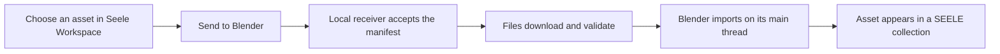

# Seele-art-blender

<p align="center"><strong>A secure Blender-side receiver for importing validated 3D asset transfers from Seele Web.</strong></p>

<p align="center">
  <a href="https://www.blender.org/"></a>
  <a href="https://github.com/SeeleAI/Seele-art-blender/releases"></a>
  <a href="LICENSE"></a>
</p>

<p align="center">
  <a href="https://www.seeles.ai/features/tools/ai-3d-model-generator-entry">Create with Seele AI 3D</a> &middot;
  <a href="#install-the-production-package">Install</a> &middot;
  <a href="#quick-start">Quick start</a> &middot;
  <a href="docs/PRIVACY_AND_NETWORK.md">Privacy and network behavior</a>
</p>

<p align="center">
  Send an asset from Seele Workspace to an open Blender session, verify its transfer, and import it into a dedicated collection.
</p>

> **Scope.** This repository contains the Blender receiver and importer. It does not run an AI model generator inside Blender, provide a standalone asset browser, or implement the Seele Web services that create and authorize transfers.

## Why Seele-art-blender?

- **Keep the workflow in Blender.** A completed import is organized in its own `SEELE_<name>` collection and can be selected and framed from the SEELE sidebar.
- **Use a narrow local receiver.** The add-on listens only on `127.0.0.1:9878`; it never binds a LAN-facing address.
- **Validate before import.** The receiver checks transfer identity and expiry, exact origins and download hosts, HTTPS URLs, safe relative paths, declared sizes, and supplied SHA-256 digests.
- **Stay informed and in control.** The sidebar reports transfer progress, supports cancellation, can retry eligible importer failures after files were verified, and clears only sentinel-managed cache data.

The product-validated end-to-end path is currently **Seele Workspace FBX → Blender**. The add-on also supports GLB, glTF, and STL when their native import operators are available in the running Blender installation; those formats have not completed the same Seele Web end-to-end validation.

## Requirements

- Blender **4.0 or newer** for the classic add-on ZIP.
- Blender **4.2 or newer** for the Extensions manifest/package path.
- Access to the production Seele website at [seeles.ai](https://www.seeles.ai).
- An internet connection to download transferred asset files.
- Localhost access to `127.0.0.1:9878` between the browser and Blender.

The package is a Blender Editor add-on. It does not become a dependency of exported assets or runtime builds.

## Install the production package

The current public production build is **0.2.3**. Download it from [GitHub Releases](https://github.com/SeeleAI/Seele-art-blender/releases) using this package name:

```text
seele-blender-0.2.3-public.zip
```

1. In Blender, open **Edit → Preferences → Add-ons**.
2. Select **Install from Disk**.
3. Choose the downloaded ZIP.
4. Enable **SEELE Transfer**.
5. Open the 3D View sidebar with `N` and select the **SEELE** tab.

To upgrade, disable and remove the previous version, exit Blender completely, then install the new package. If you no longer need downloaded transfer files, use **Clear Cache** before removing the add-on.

## Quick start

1. Start Blender and confirm that the **SEELE** sidebar reports the receiver as ready.
2. Create or choose a 3D asset in Seele. For browser-based generation, start at the [Seele AI 3D Model Generator](https://www.seeles.ai/features/tools/ai-3d-model-generator-entry).
3. In a supported Seele Workspace flow, select **Send to Blender**.
4. Keep Blender open while the add-on downloads, verifies, and imports the transfer.
5. Inspect the resulting `SEELE_<name>` collection, including its geometry, materials, textures, scale, and hierarchy.

## How the transfer works



The add-on exposes a fixed loopback HTTP receiver at `127.0.0.1:9878`. The production Seele origin requests a short-lived, single-use challenge and sends a `dcc-transfer.v1` manifest bound to that receiver installation. File downloads run in background workers; Blender API operations are queued onto Blender's main thread.

The receiver provides health/capability discovery, transfer status, cancellation, and eligible import retry. It does not accept user-configured origins, download hosts, ports, development origins, or the disabled legacy Consume flow in the public build.

## Compatibility and validation

| Area | Current support |
| --- | --- |
| Classic add-on ZIP | Blender 4.0+ |
| Extensions manifest | Blender 4.2+ (`blender_manifest.toml`) |
| Fully validated product path | Seele Workspace FBX → Blender |
| Additional capability-based formats | GLB, glTF, STL when the corresponding Blender importer is available |
| Import location | Dedicated `SEELE_<name>` collection |
| Materials | Native importer behavior; FBX materials and external textures are best-effort |
| Runtime impact | Editor-only receiver/importer; no exported-runtime dependency |

Importer availability is reported dynamically by the local receiver. A format appearing in that capability response means the Blender operator is available; it does **not** mean Seele Web end-to-end validation is complete for that format.

## Security and privacy boundary

- The HTTP server binds only to `127.0.0.1:9878`.
- The public build accepts the exact production origin `https://www.seeles.ai`; wildcards and user-expanded origin lists are not supported.
- Download URLs must use HTTPS and match the embedded host allowlist. Redirect and final destinations are checked again.
- Challenges expire after 60 seconds, are single-use, and are bound to the exact origin and receiver installation.
- Manifests are constrained to 128 files and 1 GiB per file/transfer. Safe canonical relative paths are required.
- When `sizeBytes` or `sha256` is supplied, it is strictly verified. Missing integrity metadata may be accepted for compatibility with a visible warning; hard receiver byte limits still apply.
- Signed download grants remain in memory during transfer and are excluded from public status, copied diagnostics, default HTTP logs, and Blender UI.
- Cache cleanup is limited to the managed cache containing the expected `.seele-blender-cache` sentinel and rejects protected or symlinked locations.

This boundary does not defend against a malicious native process already running on the same computer. See [Privacy and Network Behavior](docs/PRIVACY_AND_NETWORK.md) for the complete model.

## Troubleshooting

- **Receiver not ready:** fully close other Blender processes that may already use port `9878`, then restart Blender or the receiver.
- **Send to Blender does nothing:** confirm the sidebar is ready and that local security software permits loopback traffic on port `9878`.
- **Format unavailable:** check the sidebar importer readiness. GLB, glTF, and STL depend on the installed Blender operators.
- **Import warning:** inspect materials, textures, scale, and hierarchy before continuing; FBX material and external-texture handling is best-effort.
- **Download or integrity failure:** create a new transfer from Seele. Local retry is reserved for eligible importer failures after all files were verified.

For detailed recovery steps, read the [Troubleshooting Guide](docs/TROUBLESHOOTING.md).

## Documentation

- [Privacy and Network Behavior](docs/PRIVACY_AND_NETWORK.md)
- [Troubleshooting Guide](docs/TROUBLESHOOTING.md)
- [Changelog](CHANGELOG.md)

## Development

Build the reproducible public package:

```bash
python tools/build_packages.py
```

Run the unit suite:

```bash
python -m unittest discover -s tests/unit -v
```

A Blender headless import check can be run with a suitable local fixture:

```bash
blender --background --factory-startup --python tests/blender_integration/run_import.py -- fixture.fbx
```

The headless fixture requires Blender and an actual model file; the Python unit suite does not replace real browser-to-Blender product validation.

## Releases and support

[GitHub Releases](https://github.com/SeeleAI/Seele-art-blender/releases) is the download location for public production packages. Review [CHANGELOG.md](CHANGELOG.md) for version history.

Report defects through [GitHub Issues](https://github.com/SeeleAI/Seele-art-blender/issues). Include the Blender version, add-on version, transfer result, and sanitized diagnostics—never signed URLs, tokens, credentials, or local paths.

## License

Copyright © 2026 SEELE. All rights reserved. This project and its binary packages are proprietary unless SEELE provides a separate written license agreement. See [LICENSE](LICENSE) for details.
